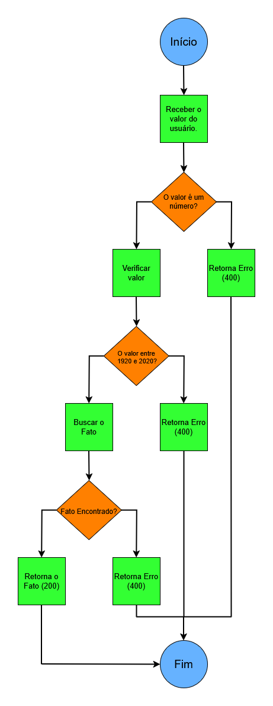

# Documento de Fluxo – API de Fatos Históricos (1920–2020) - Projeto [DevMedia](https://www.devmedia.com.br)

## 1. Objetivo
- O objetivo desse projeto é criar uma **API de fatos historicos** entre os anos *1920 - 2020*. A API irá retornar uma frase referente a um fato ocorrido no ano informado pelo usuário. 

## 2. Fluxo do Processo

### 2.1 Início

- O processo se inicia quando o usuário envia um valor para a API.

### 2.2 Validação do valor informado
- A API verifica se o valor recebido:
 - É um número.
 - Está dentro da faixa de anos permitidos (*1920 - 2020*).

**Resultado:**
- Se o valor **não for um número**, a API retorna um erro com **status 400** e uma mensagem de *"Ano inválido"*.
- Se o valor **estiver fora da faixa de ano permitida** aos anos 1920-2020, a API também retorna erro **com status 400**.

### 2.3 Busca do fato
- Se o ano for válido, a API consulta a base de dados com os fatos históricos.
- Verifica se há um fato correspondente ao ano informado.

**Resultado:**
- Se houver um fato, a API retorna o fato e o status 200 OK.
- Se não houver fato registrado, a API retorna um erro com status 400 e mensagem "Fato não encontrado".

### 2.4 Fim
- O processo termina após o retorno da resposta (sucesso ou erro).

## 3. Status HTTP utilizados
| Situação | Código HTTP |	Descrição |
|----------|-------------|------------|
| Ano informado corretamente | 200 OK |	Fato retornado com sucesso |
| Ano fora da faixa ou inválido | 400 Bad Request |	Ano inválido ou fora da faixa |
| Fato não encontrado para o ano | 400 Bad Request | Fato inexistente para o ano |

## 4. Resumo Visual
